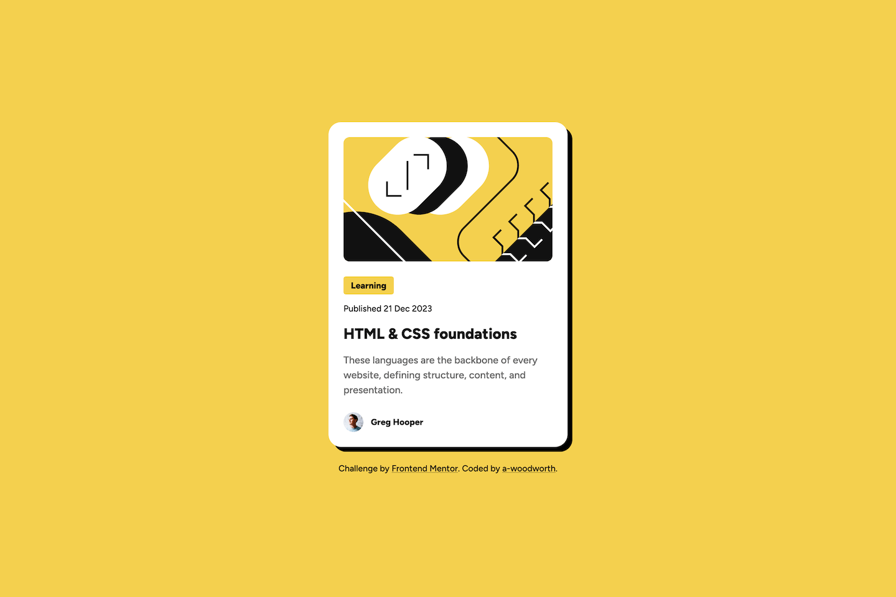
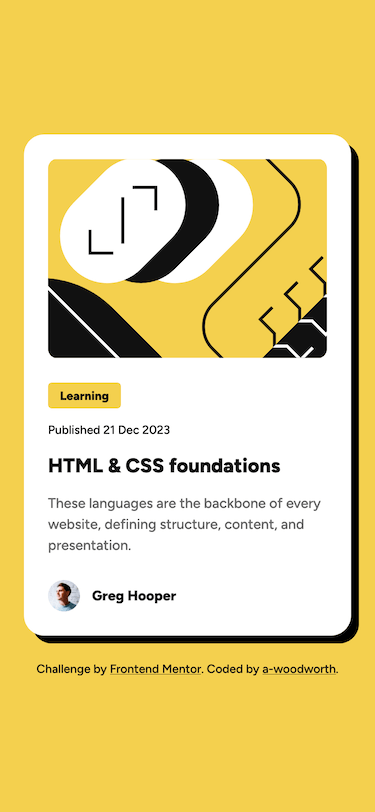

# Frontend Mentor - Blog preview card solution

This is a solution to the [Blog preview card challenge on Frontend Mentor](https://www.frontendmentor.io/challenges/blog-preview-card-ckPaj01IcS). Color modifications have been made that differ from the design to meet accessible color contrast ratios.

## Table of contents

- [Overview](#overview)
  - [The challenge](#the-challenge)
  - [Screenshots](#screenshots)
  - [Links](#links)
  - [Built with](#built-with)

## Overview

### The challenge

Users should be able to:

- See hover and focus states for all interactive elements on the page

### Screenshots

**Desktop**

**Mobile**

### Links

- Solution URL: [Solution](https://www.frontendmentor.io/solutions/blog-preview-card-bem-css-custom-properties-F005Q3IOnz)
- Live Site URL: [Live Site](https://a-woodworth.github.io/blog_preview_card)

### Built with

- Semantic HTML5 markup
- CSS Custom properties (variables)
